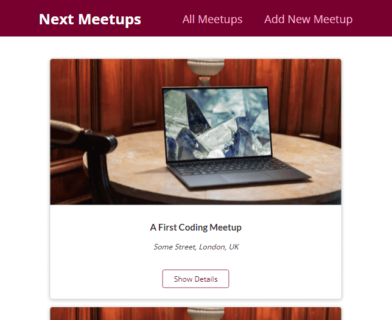

# Next Meetups

Next.js Meetups Application to see and create new Meetups using MongoDB and hosted on Vercel.

## Demo

[https://next-coding-meetups.vercel.app/](https://next-coding-meetups.vercel.app/)

# Local launch

0. Clone repo: `git clone https://github.com/AbayIbrayev/next-meetups.git`
1. `cd next-meetups`
2. Install dependencies with `yarn` or `npm install`
3. Set up your own environment variables by connecting to your [MongoDB Atlas](https://www.mongodb.com/cloud/atlas) Cluster and hiding your database access key as shown in `.envSAMPLE` file
4. Run your app with `yarn next dev` | `npm next dev` (check [localhost:3000](http://localhost:3000/))
5. Check your `localhost:3000`, for a local preview

---

Thank you!
